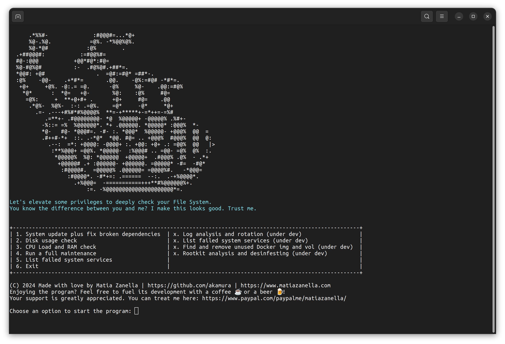

# Disk Desinfester - The Ultimate Linux Maintenance Program 🐧❤️



Welcome to Disk Desinfester, aimed to be the **first and most complete Linux Maintenance Program**. If you're looking for barbie and flashy GUIs, you're in the wrong place. Here, I celebrate the unadorned beauty of the terminal – because let's face it, old school is the best school!


## Features

- **No GUI, Just Glory:** This is a text-based paradise. Why click when you can type? The program is fully written in bash.
- **Lightning-Fast:** It's so fast, it might just finish running before you even start it! Of course, the actual speed depends on how creepy-crawly and infested your file system is. The more digital critters hiding in there, the more fun we have!
- **Comprehensive Maintenance:** From updates to file system checks, rootkit scans to de-cluttering your digital space, I've got it all. And yes, I even chase down those pesky whale files that play hide and seek in your file system.

You have the chance to restore your pc performance at it's best without messing around or desperately opt for an OS reinstall or worst case change it for a new one.


## A Little Joke for our Windows Friends 🪟

To all my Windows-using acquaintances (I hesitate to say friends – we have our differences, mainly everything Microsoft-based), keep an eye out! I might just bring 'Disk Desinfester' to your world of DLL nightmares, registry mazes, and bug-infested file systems. So, if your computer feels more like a bug infested habitat than a workstation, hang tight! A rescue mission is being planned for later this year. Just don't ask me to fix Clippy."


## Installation

Download the diskdesinfester.deb package or pack yourself from the source code

```bash
# sudo apt install ./diskdesinfester.deb
```

## Usage

To start desinfesting your pc, just open the application. After your elevate your permission the app create a shorcut in /usr/bin directory so you can call the Disk Desinfester when needed right from the terminal, simply type the command diskdesinfester.

## Uninstall

So sad that you are removing Disk Desinfester

```bash
# sudo apt remove diskdesinfester
```

## Contributing

Thoughts, prayers, infested and rescue stories and pull requests are always welcome. Especially pull requests.


## Digital coffee or beer

Enjoying the program? Feel free to fuel its development with a coffee ☕ or a beer 🍺! Your support is greatly appreciated. You can treat me here: https://www.paypal.com/paypalme/matiazanella/
